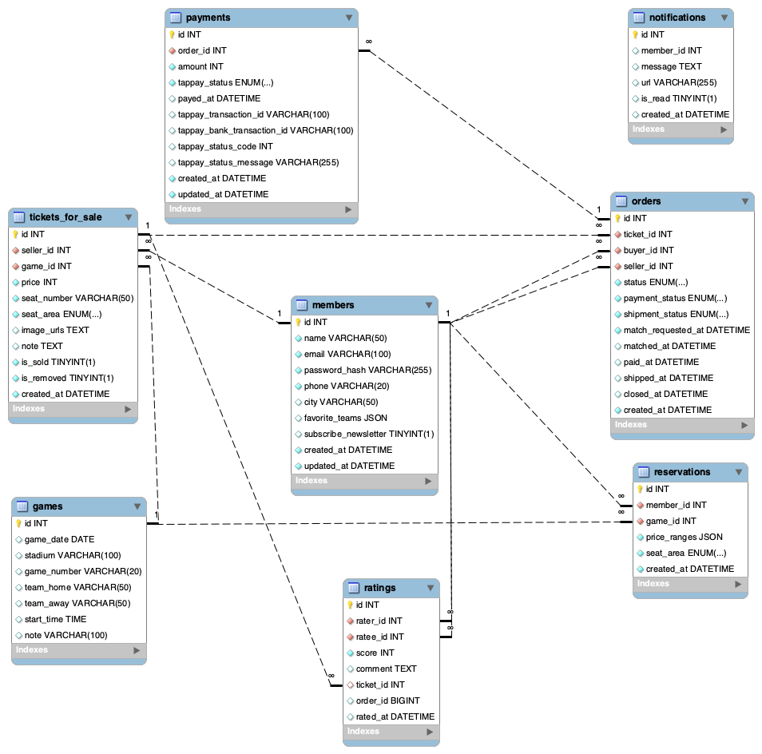

#  Pitch-A-Seat (CPBL Second-Hand Ticket Trading Platform)

##  Project Overview

**Pitch-A-Seat** is a full-featured secondary ticket trading platform for CPBL games.  
It supports ticket posting, secure payments, reservation matching, seller rating, in-site and email notifications, image uploads, and smart sorting.  
The platform also incorporates a personalized recommendation system based on multiple user behavior signals to enhance ticket discovery and user engagement.

**Website URL:** [https://pitchaseat.com](https://pitchaseat.com)

---

##  Main Features

- **Ticket Posting & Browsing**  
  Users can publish second-hand tickets with images, prices, and seat details. Tickets are browsed by clicking on a game date within the interactive calendar, allowing users to view all listings for that particular match, including seat details and prices..

- **Secure Online Payment**  
  Integrated with TapPay API to enable safe and verified online transactions between buyers and sellers.

- **Reservation System**  
  Users can reserve specific games in advance; the system will notify them instantly when relevant tickets are listed.

- **Seller Rating**  
  Buyers can rate sellers after a completed transaction, helping improve trust and transparency in the platform.

- **Real-Time Notifications**  
  Supports in-site alerts and email notifications for critical actions such as reservation matching, payment, and shipment.

- **Trending Matches Leaderboard**  
  Ranks the most traded games on the homepage based on real-time stats.

- **Personalized Recommendations**  
  Recommends suitable tickets based on user’s favorite team, order history, and reservation history.

- **Smart Sorting & Filtering**  
  Users can sort listings by published date, price, seat area, or seller rate for an optimized browsing experience.

---

##  Technical Highlights

- **Implemented complete backend workflows for ticket trading and reservation matching**  
  Supports ticket posting, payment processing, reservation requests, seller rating, and in-site notifications. The backend is fully decoupled from the frontend to enhance scalability and maintainability.

- **Integrated third-party payment API (TapPay) for secure transactions**  
  Handled payment requests, callback validation, and transaction status updates through TapPay to ensure smooth and secure payment flows.

- **Built a personalized recommendation algorithm**  
  Designed a scoring system based on user behavior, favorite teams, and reservation history, with time-decay and normalization to mitigate outliers and handle cold-start users effectively.

- **Applied Redis caching for trending match data**  
  Cached high-traffic game information in Redis to reduce repeated database queries and improve homepage loading speed.

- **Optimized MySQL performance and ensured data integrity**  
  Created indexes on frequently queried fields and applied appropriate foreign key constraints to enhance multi-table query efficiency and maintain relational consistency.

- **Implemented JWT-based user authentication system**  
  Managed user registration, login, and access control through JWT, ensuring a simple yet secure authentication flow.

- **Developed a real-time notification system: in-site alerts and email notifications**  
  Sent transactional emails via Gmail SMTP and provided in-site alerts through a notification bell and dropdown menu, actively notifying users of important actions such as ticket updates or order changes.

- **Deployed the site with Docker and Nginx**  
  Containerized the application using Docker and set up Nginx as a reverse proxy with HTTPS encryption, deploying the site on AWS EC2 for a stable and scalable production environment.

- **Established unit tests and a CI/CD pipeline**  
  Wrote unit tests with `pytest` and used GitHub Actions to automate testing and deployment, improving code reliability and development efficiency.

- **Built cloud infrastructure with AWS services**  
  Utilized AWS RDS (MySQL) for database hosting and stored static/media assets in S3, accelerated through CloudFront for efficient content delivery.

---

##  Tech Stack

###  Backend
- Python (FastAPI, pytest)

###  Database
- MySQL

###  Cloud Services
- AWS EC2  
- AWS S3  
- AWS CloudFront  
- AWS RDS  
- AWS ElastiCache (Redis)

###  Development Tools
- Git & GitHub  
- Docker  
- Nginx  
- GitHub Actions (CI/CD)

###  Frontend
- HTML  
- CSS  
- JavaScript

---

##  System Architecture

> *(Insert architecture diagram here — recommended: PNG or SVG generated via [draw.io](https://app.diagrams.net) using AWS official icons)*

---

##  Database Schema

---
