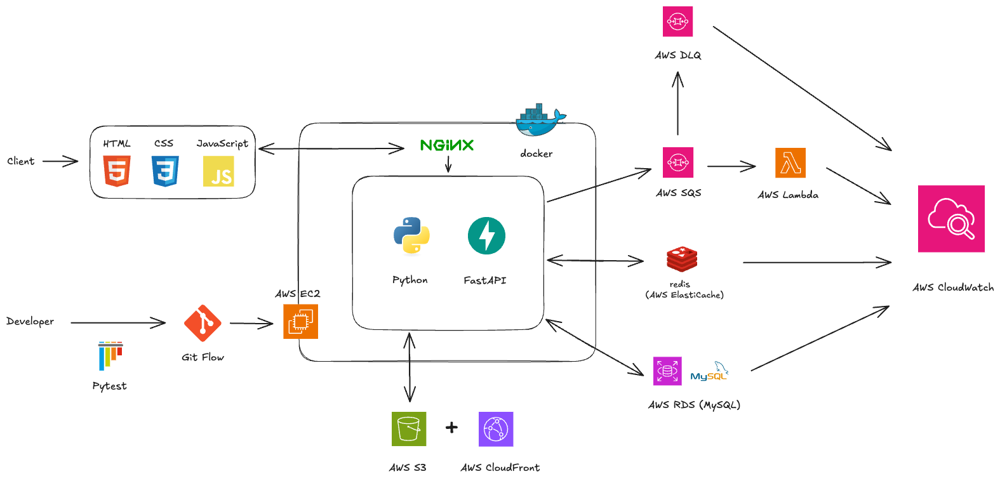
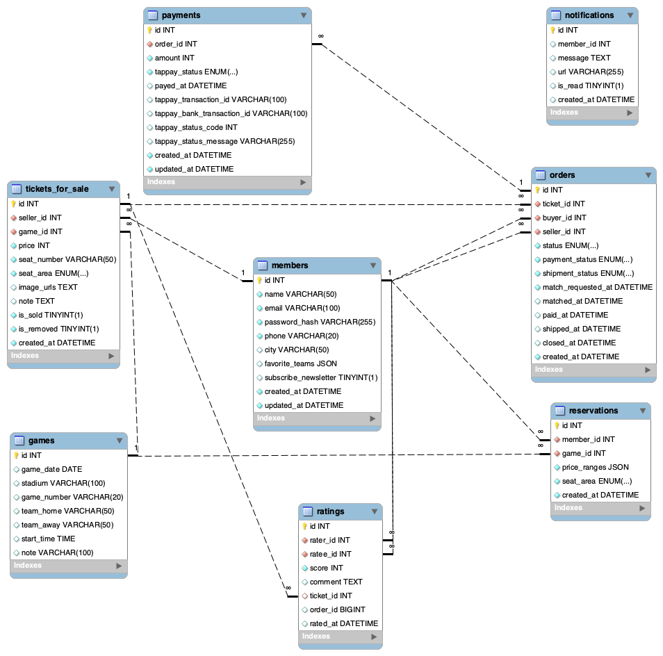

# Pitch-A-Seat (CPBL Second-Hand Ticket Trading Platform)

## Project Overview

**Pitch-A-Seat** is a full-featured secondary ticket trading platform for CPBL games.  
It supports ticket posting, secure payments, reservation matching, seller rating, in-site and email notifications, image uploads, and smart sorting.  
The platform also incorporates a personalized recommendation system based on multiple user behavior signals to enhance ticket discovery and user engagement.

**Website URL:** [https://pitchaseat.com](https://pitchaseat.com)

> 📖 For detailed architecture decisions and technical deep-dives, see [ARCHITECTURE.md](./ARCHITECTURE.md)

---

## Main Features

- **Ticket Posting & Browsing**  
  Users can publish second-hand tickets with images, prices, and seat details. Tickets are browsed by clicking on a game date within the interactive calendar, allowing users to view all listings for that particular match, including seat details and prices.

- **Secure Online Payment**  
  Integrated with TapPay API to enable safe and verified online transactions.

- **Reservation System**  
  Users can reserve specific games in advance; the system will notify them instantly when relevant tickets are listed.

- **Seller Rating**  
  Buyers can rate sellers after a completed transaction, helping improve trust and transparency.

- **Real-Time Notifications**  
  Supports in-site alerts and email notifications for critical actions such as reservation matching, payment, and shipment.

- **Trending Matches Leaderboard**  
  Ranks the most traded games on the homepage based on real-time stats.

- **Personalized Recommendations**  
  Recommends suitable tickets based on user's favorite team, order history, and reservation history.

- **Smart Sorting & Filtering**  
  Users can sort listings by published date, price, seat area, or seller rate for an optimized browsing experience.

---

## Technical Highlights

### Architecture & Code Quality

- **Modular Architecture Design**  
  Refactored a monolithic 2,048-line `app.py` into a clean, maintainable structure with clear separation of concerns:
  - `routes/` – API endpoints and request handling
  - `models/` – Database operations and data access layer
  - `utils/` – Reusable utility functions (auth, email, S3, SQS, Redis)
  - `config/` – Environment configuration and settings management

- **Race Condition Prevention**  
  Implemented database-level locking (`SELECT ... FOR UPDATE`) and atomic updates to prevent concurrent transaction conflicts in high-traffic scenarios.

- **Unit Testing with pytest**  
  Built comprehensive test suites following the AAA pattern (Arrange-Act-Assert), covering authentication utilities with 22 test cases including positive, negative, and boundary tests.

### CI/CD & DevOps

- **Automated CI/CD Pipeline (GitHub Actions)**  
  Configured end-to-end automation: on every push to `main`, the pipeline runs unit tests, builds Docker images, pushes to Docker Hub, and deploys to EC2 automatically.

- **Docker & Docker Compose**  
  Containerized application with Docker, using separate configurations for development (`docker-compose.yml`) and production (`docker-compose.prod.yml`).

- **AWS CloudWatch Monitoring**  
  Set up proactive alerting for system health:
  - EC2/RDS/Redis CPU and status monitoring
  - Lambda error tracking
  - SQS Dead Letter Queue alerting
  - RDS storage monitoring

### AWS Cloud Services

- **S3 + CloudFront for Image Delivery**  
  Implemented image upload pipeline to S3 with CloudFront CDN distribution for faster global content delivery and reduced server load.

- **SQS + Lambda for Async Email Processing**  
  Decoupled email sending from the main request cycle using SQS queues and Lambda functions, improving API response times and system resilience with automatic retry via Dead Letter Queue.

- **ElastiCache (Redis) for Caching**  
  Applied Redis caching with connection pooling for high-traffic endpoints, significantly reducing database load for trending match data.

### Core Features Implementation

- **Third-Party Payment Integration (TapPay)**  
  Integrated TapPay API for secure transactions, handling payment requests, callback validation, and transaction status updates.

- **Personalized Recommendation Algorithm**  
  Built a scoring system based on user behavior, favorite teams, and reservation history, with time-decay weighting and normalization to mitigate outliers and handle cold-start users effectively.

- **Real-Time Notification System**  
  Developed both in-site alerts (notification bell with dropdown) and email notifications for critical actions such as reservation matching, payment confirmation, and order updates.

### Database & Performance

- **Transaction Management for Data Consistency**  
  Applied database transactions to ensure atomic operations in critical flows like order creation and payment processing, preventing partial updates and maintaining data consistency.

- **AWS RDS (MySQL) for Data Persistence**  
  Deployed MySQL on AWS RDS for reliable, managed database hosting with automated backups.

- **Optimized MySQL Queries**  
  Created indexes on frequently queried fields, optimized complex JOIN operations, and ensured data integrity with foreign key constraints.

- **JWT-Based Authentication**  
  Implemented secure token-based authentication with bcrypt password hashing and configurable token expiration.

- **UTC Timezone Standardization**  
  Unified all datetime handling to UTC, eliminating timezone-related bugs across different regions.

---

## Tech Stack

| Category            | Technologies                                     |
| ------------------- | ------------------------------------------------ |
| **Backend**         | Python, FastAPI                                  |
| **Database**        | MySQL (AWS RDS)                                  |
| **Caching**         | Redis (AWS ElastiCache)                          |
| **Cloud Services**  | AWS EC2, S3, CloudFront, SQS, Lambda, CloudWatch |
| **Version Control** | Git, GitHub                                      |
| **CI/CD**           | GitHub Actions, Docker, Docker Compose           |
| **Infrastructure**  | Nginx (Reverse Proxy, HTTPS), Docker             |
| **Testing**         | pytest                                           |
| **Payment**         | TapPay API                                       |
| **Frontend**        | HTML, CSS, JavaScript                            |

---

## Project Structure

```
pitch-a-seat/
├── app.py                 # Application entry point
├── config/
│   ├── database.py        # Database connection management
│   └── settings.py        # Environment configuration
├── routes/                # API endpoints
│   ├── auth.py
│   ├── orders.py
│   ├── tickets.py
│   └── ...
├── models/                # Database operations
│   ├── order_model.py
│   ├── ticket_model.py
│   └── ...
├── utils/                 # Utility modules
│   ├── auth_utils.py      # JWT & password utilities
│   ├── redis_utils.py     # Redis connection pool
│   ├── s3_utils.py        # S3 upload utilities
│   ├── sqs_utils.py       # SQS message queue
│   ├── email_utils.py     # Email sending (sync/async)
│   └── ...
├── lambda_functions/
│   └── email_sender.py    # Lambda handler for async email
├── tests/
│   ├── conftest.py        # pytest fixtures
│   └── test_auth_utils.py # Authentication unit tests
├── .github/workflows/
│   └── deploy.yml         # CI/CD pipeline configuration
├── docker-compose.yml     # Development environment
├── docker-compose.prod.yml # Production environment
└── Dockerfile
```

---

## System Architecture



---

## Database Schema



---

## Local Development

```bash
# Clone repository
git clone https://github.com/yychung-dev/pitch-a-seat.git
cd pitch-a-seat

# Set up environment variables
cp .env-example .env
# Edit .env with your configurations

# Run with Docker Compose
docker-compose up -d --build

# Run tests
pytest tests/ -v
```

---

## Deployment

This project uses GitHub Actions for automated deployment:

1. Push to `main` branch
2. GitHub Actions automatically:
   - Runs unit tests
   - Builds Docker image
   - Pushes to Docker Hub
   - Deploys to EC2

---
