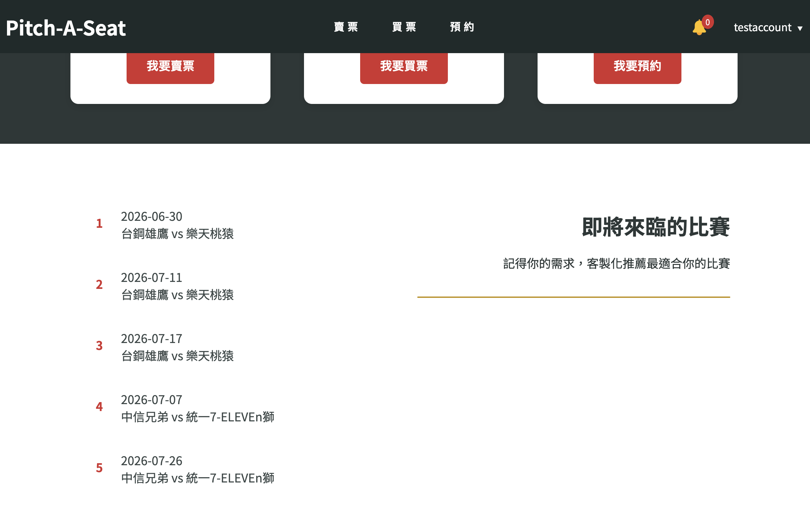
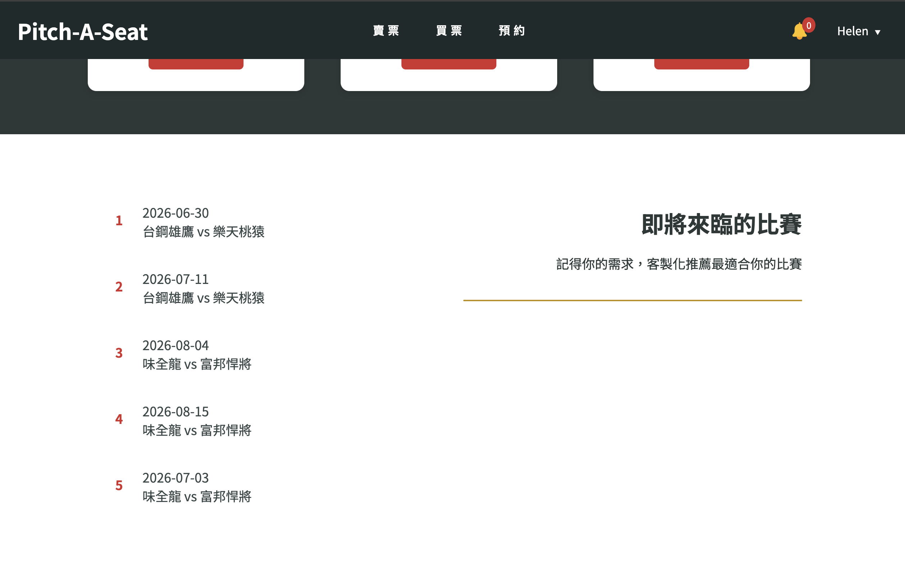
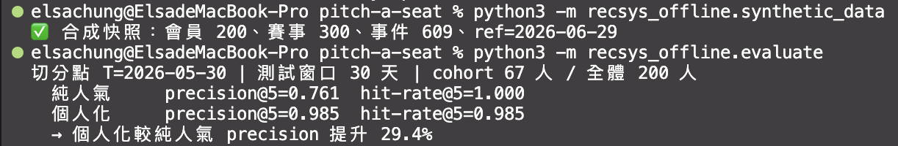
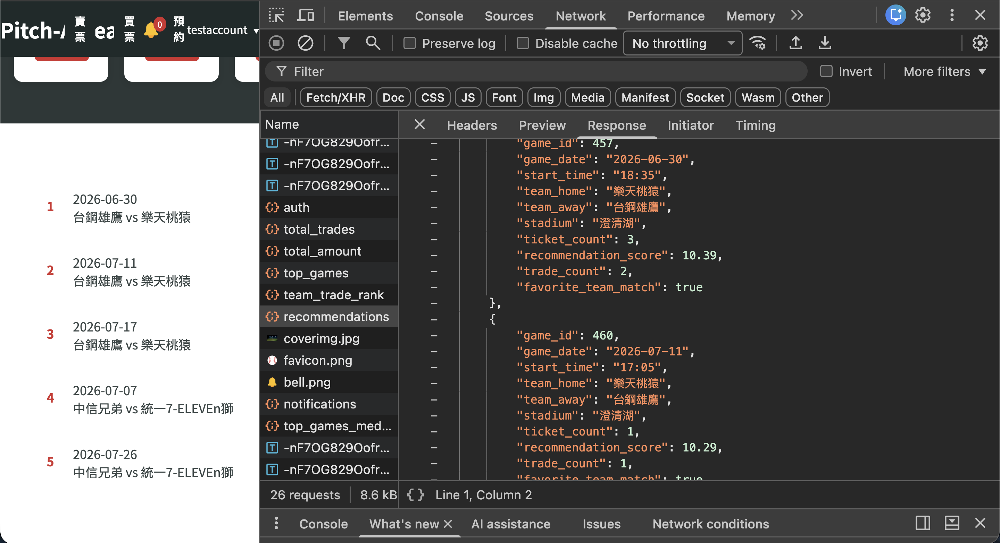
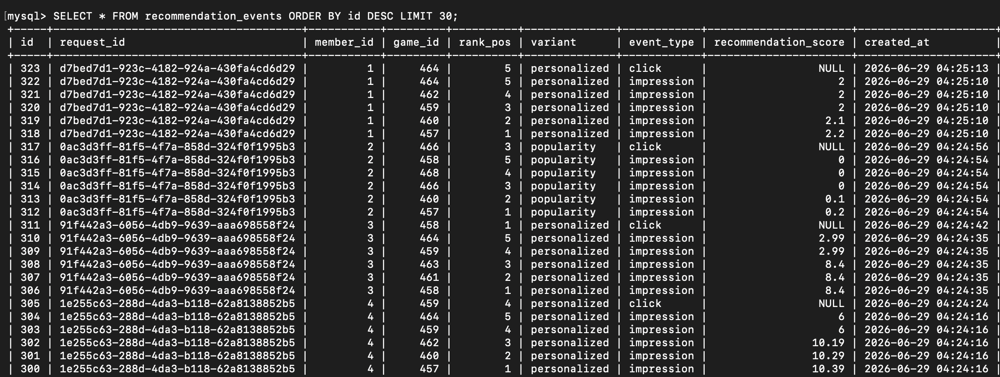
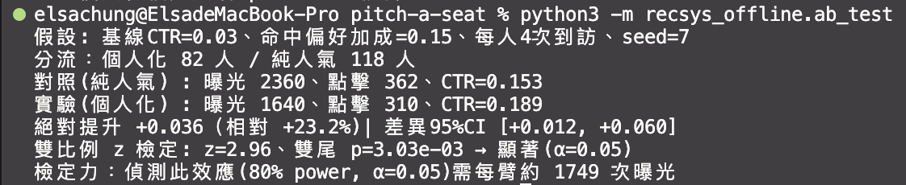

# 個人化推薦系統 — Pitch-A-Seat

> 繁體中文 | [English](./RECOMMENDATION_SYSTEM.md)

把首頁推薦從「**有缺陷、無法量測的個人化雛形**」，重構為「**真正 per-user 個人化 + 可離線評估 + 事件記錄 + A/B 測試**」的端到端推薦系統。

本文件是推薦系統的完整設計文件(single source of truth)，深入說明設計、評估方法與決策取捨。專案全貌請見 [README](./README.md) ; 其他技術決策請見 [ARCHITECTURE](./ARCHITECTURE.md)。

---

## TL;DR

Pitch-A-Seat 是一個 CPBL 中華職棒二手票券交易平台。此平台原本就有推薦功能，但**個人化是半失效的**，因為行為訊號的查詢沒有限定到當前使用者，而且整套推薦邏輯無法被測試或量測。因此將其重構為**真正因人而異、且從第一天就可被量測**的推薦系統:

- **修好個人化**:讓行為訊號真正 per-user，並移除一段會灌爆分數的無效正規化。
- **推得更準**:離線評估(時間切分、precision@5)顯示個人化較純人氣基準 **提升 29.4%**(0.99 vs 0.76)。
- **帶動點擊**:模擬 A/B 測試(雙比例 z 檢定)顯示個人化使 CTR **相對提升 23.2%**(z=2.96, p=0.003)，並誠實標註目前真實流量尚不足以做線上實驗。
- **可維護、可信賴**:評分邏輯抽成**純函式**，線上服務與離線評估**共用同一份程式碼**(無 train/serve skew)，並有 **22 個單元測試 + CI** 把關每次合併。

這次專案升級的重點是：把推薦做成一個**可量測、可實驗、能持續改進**的系統，而不只是一個會跑出結果的功能。

---

## 目錄

1. [問題:升級前的限制](#1-問題升級前的限制)
2. [系統架構](#2-系統架構)
3. [個人化評分設計](#3-個人化評分設計)
4. [離線評估](#4-離線評估)
5. [事件記錄與點擊追蹤](#5-事件記錄與點擊追蹤)
6. [A/B 測試](#6-ab-測試)
7. [資料品質](#7-資料品質)
8. [測試與 CI/CD](#8-測試與-cicd)
9. [決策日誌](#9-決策日誌)
10. [限制與後續](#10-限制與後續)

---

## 1. 問題:升級前的限制

升級前，首頁的「即將來臨的比賽」**已經有個人化的雛形**:它會把使用者的喜愛球隊加分，也會把使用者的交易、預約紀錄依時間衰減加權，再排序推薦。表面上會動，但深入程式碼後，有三個問題:

**問題一:個人化是半失效的：行為訊號沒有限定到「這個人」。**
喜愛球隊的查詢有帶使用者 ID，是真正 per-user 的; 但**交易與預約的查詢只過濾了時間，沒有過濾使用者**:

```python
# 升級前：撈的是「全站所有人」過去 90 天的交易，不是「這個會員自己的」
trades = get_trades_in_period(past_90_days)
```

結果是:每位使用者拿到的「行為加分」其實是**同一批全站行為**，對個人化幾乎沒有貢獻。真正讓使用者之間有差異的，**只剩喜愛球隊那一項**。換句話說，兩個喜愛球隊相同(或都沒設定)的使用者，看到的推薦會幾乎一樣，行為驅動的個人化形同虛設。此外，一段試圖「減去平均」的正規化，對多筆行為的加總根本壓不下來，反而讓分數被灌爆。

**問題二:完全無法量測。**
沒有任何記錄能回答「推薦有沒有被看到、有沒有被點」。要改進推薦，卻沒有衡量改進的依據，這樣任何調整都只能憑感覺，無法證明有沒有變好。

**問題三:無法驗證與演進。**
評分邏輯與資料查詢、HTTP 處理全部交纏在路由層，無法在不啟動整個服務、不連資料庫的情況下測試或離線評估;冷啟動的熱門賽事查詢還用了 INNER JOIN，在沒有訂單時會回空，讓補位機制落空。

這次升級因此聚焦三件事，對應上面三個問題:

1. **讓個人化真正 per-user**：修正行為查詢與計分邏輯。
2. **讓推薦可被量測**：加入曝光/點擊記錄與 A/B 測試。
3. **讓邏輯可被獨立驗證與離線評估**：把評分抽成純函式，並修好冷啟動。

後續每一節，都對應這三個目標的其中一塊，並在過程中保持工程上的誠實:明確標註每個假設與限制。

---

## 2. 系統架構

升級的核心是一個結構性的改變:**把推薦的「評分邏輯」從路由層抽出來，變成一層獨立、不碰資料庫也不碰 HTTP 的純函式服務**。這一層是後續所有能力(可測試、可離線評估、線上離線一致)的基礎。

分層如下:
前端首頁

│ GET /api/recommendations（帶 JWT）

▼

路由層 routes/games.py

│ - 驗證使用者、查 DB 取得「這個人」的喜愛球隊與行為

│ - 決定 A/B 分流（personalized / popularity）

│ - 背景記錄曝光事件

▼

服務層 services/recommender.py ◄── 純函式，無 DB / HTTP / 時鐘

│ recommend(): 算分 → 排序 → 冷啟動補位

│ ↑ 同一份程式碼，也被離線評估直接呼叫

▼

資料層 models/game_model.py, models/recommendation_event_model.py

│ per-user 行為查詢、賽事查詢、事件寫入

▼

DB（MySQL / AWS RDS）

▲

│ 凍結快照（固定 seed）

recsys_offline/ ◄── 餵歷史資料給「同一個 recommend()」算 precision、跑 A/B

關鍵在最後兩個箭頭:**線上服務和離線評估呼叫的是同一個 `recommend()`**。線上把真實使用者的資料餵進去、回傳推薦;離線把凍結的歷史快照餵進去、計算指標。因為兩邊共用同一份實作，**離線評估出來的數字，就是線上真正會跑的邏輯**，不會有「評估時是一套、上線後變另一套」的落差(train/serve skew)。這是整個設計的地基。

> 完整的資料表結構與系統部署架構見 [README](./README.md);本文件聚焦推薦系統本身。

---

## 3. 個人化評分設計

推薦分數由三個部分組成，全部以「**這個使用者自己的**」資料計算:

1. **喜愛球隊基礎分**:使用者明確設定的喜愛球隊，給予基礎分。這是最強、最明確的偏好訊號。
2. **行為時間衰減分**:使用者**自己的**交易與預約紀錄，依「距今天數」做指數衰減加權：越近期的行為，對偏好的影響越大。這正是升級時修正的核心:**行為查詢現在帶入 `member_id`，真正只看這個人的行為**，而不是過去那樣撈全站。
3. **冷啟動補位**:當個人化訊號不足以湊滿推薦數量時(例如全新、零行為的使用者)，用即將到來的熱門賽事補上，確保每個人都有內容可看。

這三部分加總、排序後，取出推薦清單。

**這一段邏輯被刻意寫成「純函式」**它的輸入是「使用者的喜愛球隊、行為紀錄、候選賽事」這些**現成的資料**，輸出是「排好序的推薦」，中間**不碰資料庫、不發 HTTP、不讀系統時間**。所有「現在幾點、要查哪個人」這類與外界互動的事，都留在路由層處理好，再把資料餵進來。

這個設計帶來三個直接好處，後面幾節會一一展開:

- **可單元測試**:給定一組輸入就能斷言輸出，不需啟動服務或連資料庫(見 [§8](#8-測試與-cicd))。
- **可離線評估**:同一個函式能直接餵歷史資料算指標(見 [§4](#4-離線評估))。
- **線上離線一致**:沒有 train/serve skew(見 [§2](#2-系統架構))。

實際效果可以直接從線上看出來。以下是兩個喜愛球隊不同的使用者，在同一時間造訪首頁看到的推薦:

| 使用者 A(喜愛台鋼雄鷹、中信兄弟) |
| -------------------------------- |



| 使用者 B(喜愛富邦悍將、樂天桃猿) |
| -------------------------------- |



兩份推薦完全不同，且各自對齊使用者的偏好球隊，這樣個人化就真正做到了 per-user。

---

## 4. 離線評估

要回答「個人化到底有沒有比較好」，需要一個**不靠線上流量、可重現**的衡量方式。這一節用離線評估來回答。

**方法:時間切分(防未來洩漏)。**
取一個切分時間點 T，只用 **T 之前**的資料產生推薦，再拿 **T 之後**使用者真實的行為當「答案」來驗證。這樣評估時，模型看不到任何未來的資訊：這對推薦系統很重要，因為若不小心用了未來資料，指標會虛高、上線後現出原形。

**指標:precision@5 與 hit-rate@5。**

- **precision@5**:推薦的 5 場裡，有多少比例命中使用者之後真的會互動的球隊。衡量「**推得準不準**」。
- **hit-rate@5**:推薦的 5 場裡，至少命中 1 場的使用者比例。衡量「**有沒有覆蓋到**」。

**對照組:** 純人氣推薦(對所有人推同一份熱門排行榜)，作為「不做個人化」的基準線。

在固定隨機種子的合成快照(200 名使用者、300 場賽事)上，切分點 T 之後有 67 名使用者產生可驗證的行為。結果:
切分點 T=2026-05-30 | 測試窗口 30 天 | cohort 67 人 / 全體 200 人

純人氣 precision@5=0.761 hit-rate@5=1.000

個人化 precision@5=0.985 hit-rate@5=0.985

→ 個人化較純人氣 precision 提升 29.4%

**跑 evaluate 的輸出結果** <br>


**怎麼讀這組數字:**

- **precision@5 從 0.761 → 0.985，提升 29.4%**:個人化推薦命中使用者真實偏好的比例明顯更高，表示它**推得更準**。
- **hit-rate@5:個人化 0.985 略低於純人氣的 1.000**。這是一個**誠實的取捨**:純人氣把熱門賽事推給所有人，幾乎人人都至少碰到一場(覆蓋滿分)，但代價是精準度低;個人化集中推使用者真正偏好的球隊，精準度大幅提升，只在極少數使用者上少了那「至少一場」的覆蓋。

這個系統真實的行為是：個人化用一點點覆蓋率，換來大幅的精準度提升，這對「幫使用者快速找到想看的比賽」這個目標而言，是划算的取捨。

---

## 5. 事件記錄與點擊追蹤

光是「推得準」還不夠，若要持續改進，得知道推薦**實際上有沒有被看到、有沒有被點**。升級前完全沒有這類記錄;升級後加入了一張 append-only 的事件表 `recommendation_events`，記錄兩種事件:

- **曝光(impression)**:每次推薦清單回傳給前端，逐一記下這次推了哪些賽事、各自的名次與分數。
- **點擊(click)**:使用者點了哪一張推薦卡片。

**核心設計:用 `request_id` 把點擊接回造成它的那次曝光。**
每一次推薦請求，後端會產生一個唯一的 `request_id`(correlation id)，隨曝光一起記錄，並透過 response header 回傳給前端。當使用者點擊某張卡片時，前端把這個 `request_id` 一起送回，於是後端就能把「這次點擊」精確接回「造成它的那次曝光」。
一次推薦 = 一個 request_id

├─ impression: game 457, rank 1, score 10.39

├─ impression: game 460, rank 2, score 10.29

├─ ...

└─ click: game 457 ← 用同一個 request\*id 接回上面那次曝光<br>
<br>
**Network Response: 回傳推薦賽事資訊紀錄**<br>

<br>
**recommendation events 資料表紀錄: request_id 綁定曝光與點擊**<br>


有了這個關聯，就能算出推薦系統最關鍵的線上指標：**CTR(點擊率 = 點擊數 / 曝光數)**，以及後續的漏斗分析。這正是廣告與搜尋系統用來衡量推薦成效的標準做法。

**工程取捨:曝光記錄用「背景任務、盡力而為」。**
曝光事件是透過 FastAPI 的背景任務(background tasks)寫入的，而且**刻意設計成不影響使用者請求**:就算事件寫入失敗，也只會吞掉例外、記個 log，使用者照常拿到推薦，不會因為「記錄分析資料」這種次要工作而拖慢或中斷主流程。

這是一個明確的取捨:**用「可能偶爾掉一筆事件」換取「分析永不影響使用者體驗」**。在目前的流量規模下，這個取捨是划算的，掉一筆曝光對統計幾乎無影響，但拖慢使用者請求的代價很高。若未來流量變大、或需要「一筆都不能掉」的保證，可以改用持久化訊息佇列(例如本專案非同步寄信已採用的 SQS 服務)。在分析管線的「可靠度」與「成本」間做衡量與判斷，不是一律使用最高規格但可能成本很高的方案。

---

## 6. A/B 測試

離線評估證明了個人化「推得更準」(precision)。但「準」不等於使用者「會點」。要驗證個人化是否真的帶動點擊，需要 A/B 測試:把使用者分成兩組，一組看個人化推薦、一組看純人氣推薦，比較兩組的 CTR。

**分流:穩定雜湊(stable hashing)。**
每位使用者被分到哪一組，是用「使用者 ID 的雜湊」決定的：同一個人**每次都會落在同一組**，不會這次個人化、下次純人氣。這確保了實驗組別的一致性，也讓分流可重現。

**目前的限制:真實流量不足，所以先做模擬。**
要做出有統計檢定力的線上 A/B，需要相當數量的曝光(詳細計算結果如下)。這個新上線的平台真實流量還遠遠不夠，因此這一節用**一個設定明確前提的模擬**來示範整套分析方法，重點是展示「如何設計實驗、如何做統計檢定、如何誠實詮釋結果」，而不是宣稱一個來自真實流量的結論。

**設定明確前提的模擬:** 基線點擊率 3%; 當推薦命中使用者偏好時，點擊傾向額外 +15%;每位使用者 4 次造訪。在這組假設下，對固定種子的合成使用者跑分流與點擊模擬，結果:
假設: 基線CTR=0.03、命中偏好加成=0.15、每人4次到訪、seed=7

分流：個人化 82 人 / 純人氣 118 人

對照(純人氣) : 曝光 2360、點擊 362、CTR=0.153

實驗(個人化) : 曝光 1640、點擊 310、CTR=0.189

絕對提升 +0.036（相對 +23.2%) | 差異95%CI [+0.012, +0.060]

雙比例 z 檢定: z=2.96、雙尾 p=3.03e-03 → 顯著(α=0.05)

檢定力：偵測此效應(80% power, α=0.05)需每臂約 1749 次曝光

**跑 ab_test 的輸出結果** <br>


**怎麼讀這組數字:**

- **CTR 從 0.153 → 0.189，相對提升 23.2%**:在模擬假設下，個人化使點擊率明顯上升。
- **雙比例 z 檢定:z=2.96,p=0.003**:這個檢定回答「兩組 CTR 的差異，有沒有可能只是隨機波動造成的?」。p=0.003 遠小於 0.05，代表「若兩組其實沒差，卻看到這麼大差異」的機率只有約 0.3%，所以這個差異在統計上**顯著**，不太可能是運氣。
- **95% 信賴區間 [+0.012, +0.060]**:這個區間**完全落在 0 的右邊**(不含 0)，與「顯著」的結論一致;它也告訴我們效應大小的合理範圍，CTR 絕對提升大約落在 1.2 到 6.0 個百分點之間。
- **檢定力:需每臂約 1749 次曝光**:這是最誠實、也最關鍵的一行。它說的是:**要可靠地偵測到這個大小的效應，每組需要約 1749 次曝光**。它點出了「目前真實流量不足以做線上 A/B」的具體門檻，也是這套系統「準備好上線實驗、只待流量累積」的證明。

**這一節要展現的，不是一個漂亮的數字，而是一套完整、誠實的實驗方法**:會分流、會做統計檢定、會算檢定力、會在流量不足時誠實標註而不是硬報結論。當真實流量累積到足夠時，只要把模擬的點擊換成 `recommendation_events` 裡的真實曝光與點擊，同一套分析就能直接產出線上結論。

---

## 7. 資料品質

事件資料一旦要拿來做分析與實驗，**資料品質**就成了必須處理的問題。這裡有兩個刻意的設計決策。

**決策一:事件表是 append-only(只新增、不修改、不刪除)。**
`recommendation_events` 裡的每一筆曝光與點擊，寫進去之後就不再更動。這讓事件資料具有**可稽核、可重現**的性質:任何時候回頭分析，看到的都是當時真實發生的記錄，不會因為事後修改而失真。這也是業界處理事件流(event stream)的標準做法。

**決策二:測試與內部流量，用「分析時排除」而非「刪除」處理。**
開發與 demo 過程中，內部帳號會產生不少測試性質的曝光與點擊。這些資料若混進實驗分析，會污染結果。直覺的做法是把它們刪掉，但這違反了「append-only」原則，也破壞可稽核性。

採取的做法是:**保留所有資料，在分析時用一份內部帳號清單把它們過濾掉**。這樣既維持事件表的不可變與完整，又確保分析只看真實使用者的行為。同樣地，A/B 分析也把內部帳號排除在實驗之外，避免測試流量扭曲組別比較。

這個取捨背後的原則是:**原始資料要保持完整與真實，清理應該發生在分析層，而不是去動原始記錄**。刪資料看似乾淨，卻會失去「事後重新分析、或驗證當初判斷」的能力，對一個要持續演進的推薦系統來說，這個能力比表面乾淨更重要。

---

## 8. 測試與 CI/CD

推薦邏輯能被測試，是受益於「抽成純函式」的設計。因為評分邏輯不碰資料庫、不碰 HTTP、不讀系統時間，測試只要給定一組輸入、斷言輸出即可，不需啟動服務、不需連資料庫。

**單元測試:22 個案例，涵蓋評分邏輯的關鍵行為。** :

- **A/B 分流的一致性與內部帳號白名單**:驗證同一個使用者每次都分到同一組(分流穩定、可重現)、分流大致均衡、且只會落在兩個合法組別;內部/demo 帳號被固定在個人化組。守著[§6](#6-ab-測試) 實驗的前提：分流若不穩定，整個 A/B 就不可信。
- **分數的防禦性邊界(不被灌爆)**:驗證 per-user 多筆行為加總後，分數仍落在合理範圍(不會像升級前那樣爆到數百)。
- **行為的時間衰減**:驗證近期行為的權重高於遠期行為，是 precision 提升的來源。
- **API 契約:欄位、過濾與旗標**:驗證 0 分賽事被過濾、結果依分數降序、正確取出 top-k、`favorite_team_match` 旗標正確。這守住前端與 API 之間的契約，避免回傳給前端的格式跑掉。
- **兩臂行為差異的端到端驗證**:同一組輸入，個人化臂把喜愛球隊的賽事排第一、純人氣臂則因該場無人氣而濾掉，證明了「兩組推薦真的不同」，是 A/B 測試能成立的根本前提。

測試遵循 AAA 模式(Arrange-Act-Assert)，涵蓋零行為、無喜愛球隊等邊界情況。

**CI:測試在每個 PR 上自動執行，把關每次合併。**
CI 流程設定為**在 pull request 觸發時就跑測試**，而不是等合併後才跑。這代表每一次要併入的變更，都必須先通過全部測試才能 merge，如此測試成為合併的守門員，而不是事後的檢查。

部署則只在變更真正進入主分支時才執行。CI 流程裡用條件守衛區分這兩件事:**PR 階段只跑測試(驗證)，推上主分支才觸發部署**。這樣一來，文件或實驗性的 PR 會跑測試、但不會誤觸發部署，讓「驗證」與「上線」各司其職。

> 完整的 CI/CD pipeline(Docker build、推送、部署到 EC2)見 [README](./README.md) 與 [ARCHITECTURE](./ARCHITECTURE.md);本節聚焦推薦系統相關的測試與守門設計。

---

## 9. 決策日誌

這一節把整個升級過程的關鍵決策集中起來，每一條記錄「做了什麼、為什麼、取捨是什麼」。這份日誌呈現的不是「寫了哪些功能」，而是「面臨選擇時如何做取捨及決策」。

**1. 把評分邏輯抽成純函式服務層** <br>
原因: 讓同一份邏輯能同時服務線上請求與離線評估，並且可被單元測試。`recommend`、`build_team_scores`、`rank_candidate_games`、`apply_cold_start` 都不碰資料庫、不碰 HTTP、不讀系統時間。<br>
取捨:多了一層抽象，需要把「與外界互動(查 DB、讀時鐘)」和「純計算」分離。優點是：無 train/serve skew、可測試、可離線評估。這是後續所有進階應用的地基，也是本專案軟體工程與分析能力的最核心價值。

**2. 從資料流層級定位並修正半失效的個人化**<br>
原因:升級前的行為查詢沒有帶 `member_id`，撈的是全站行為，使得使用者之間的差異幾乎只來自喜愛球隊，行為驅動的個人化形同虛設。<br>
取捨:這是純粹的 Bug 修正，不存在架構設計上的取捨。但它的價值在於「發現過程」:系統表面上看起來有個人化，要從 SQL 與資料流層級追進去，才會看出行為訊號根本沒過濾到本人。

**3. 把「個人訊號」與「人氣訊號」明確分離**<br>
原因:既然全站行為不該混進個人化，就把計分清楚拆成兩層。個人訊號來自使用者自己的喜愛球隊與行為，人氣訊號來自全站熱度，各自命名、各自計算。<br>
取捨: 計分邏輯比「混在一起」稍微多幾個步驟，但可解釋性較高。每一分從哪裡來都說得清楚，評估與調整時也能就不同層分別檢視。

**4. 移除無效的正規化**<br>
原因:原本「減去平均」的正規化，對多筆行為的加總壓不下來，反而讓分數被灌爆、失去區分度。<br>
取捨:移除後分數更乾淨、可解釋。寧可用簡單清楚、能被測試驗證的計分，也不保留一段看似聰明、實則無效的邏輯。

**5. 修正冷啟動的賽事查詢(INNER JOIN 改 LEFT JOIN)**<br>
原因:冷啟動補位的熱門賽事查詢原本用 INNER JOIN，在賽事沒有訂單時整列被濾掉，導致補位落空、新使用者可能湊不滿推薦。<br>
取捨: 改成 LEFT JOIN 後，沒有訂單的賽事也能被納入候選、以人氣補位，確保資料查詢的正確性。

**6. 用 correlation id(`request_id`)串接曝光與點擊**<br>
原因:要算 CTR、做漏斗分析，必須能把「點擊」接回「造成它的那次曝光」。<br>
取捨:每次請求多產生並傳遞一個 id，但可以精確到「單次推薦、單一名次」粒度的點擊歸因，這是廣告與搜尋系統的標準做法，也是產品分析能算出可信指標的前提。

**7. 曝光記錄用 best-effort 背景任務，而非持久化佇列**<br>
原因:目前流量規模下，分析記錄不該影響使用者請求，掉一筆曝光對統計幾乎無影響。<br>
取捨:用「可能偶爾掉一筆事件」換「分析永不影響使用者體驗」。若未來需要「一筆不掉」的保證，可改用 SQS(本專案寄信已有現成路徑)。讓管線的可靠度匹配掉一筆資料的代價，而不是一律上最重的方案。

**8. 離線評估用時間切分，而非隨機切分**<br>
原因:推薦是在預測使用者「之後」的行為。若用隨機切分，模型會看到未來資訊，指標會虛高、上線後現出原形。<br>
取捨:時間切分讓評估更接近真實上線情境，代價是可用的驗證樣本變少(只有切分點之後仍有行為的使用者)。誠實標註 cohort 大小與覆蓋率，並追求分析的嚴謹度，比追求漂亮的數字更重要。

**9. 事件表 append-only，測試流量用排除而非刪除**<br>
原因:保持原始資料的可稽核與可重現。<br>
取捨:分析時要多做一步過濾(排除內部帳號)，但能讓原始記錄永遠完整、可事後重新分析。清理發生在分析層，不動原始資料，維持資料品質。

**10. A/B 用設定明確前提的模擬，並誠實標註 underpowered**<br>
原因:真實流量不足以做有檢定力的線上實驗，但分析方法本身值得先建好、先驗證。<br>
取捨:模擬結論不能當作真實效應宣稱。但是設計一套「流量一到就能直接套用」的完整實驗框架，以及對自身限制的清楚認知(檢定力需每臂約 1749 次曝光)。清楚說明限制，提升實驗設計的可信度。

**11. 線上 A/B 的前置關卡: 先做 SRM 檢查，且檢查單位要對齊分流單位**<br>
原因:當真實流量足夠、要用 recommendation_events 取代模擬時，第一件事不是比較 CTR，而是先確認實驗本身是健康的。SRM(sample ratio mismatch，樣本比例失衡)檢查實際分流比例是否符合預期:若設定 50/50 卻跑出 70/30，代表分流機制有 bug 或某一組載入失敗，此時兩組不再隨機同質，任何 CTR 比較與 p 值都失去意義。關鍵在於檢查的單位必須對齊隨機化的單位:本專案以 member_id 雜湊分流，被隨機分派的是「使用者」，因此要看的是兩臂的使用者數比例，而非曝光數比例。曝光數會被「某一臂的使用者剛好較活躍」干擾，用它判斷分流健康會誤判。<br>
取捨:目前尚未實作。現階段線上事件量本來就不足以下結論(見 §10)，還沒到「開獎」的時機，就還不需要「驗骰子」；此時寫一段用不到的檢定，不如先把限制與做法記錄清楚。待流量到位、要用 ctr_report 產出線上結論時再補上兩件事: 在事件彙總查詢加入 COUNT(DISTINCT member_id) 取得各臂使用者數，並以卡方適合度檢定比對預期分流比例(SRM 是「實驗壞掉」的警訊而非有趣的發現，門檻應比一般顯著水準更嚴，例如 p < 0.001 即拉警報)。按照先後順序，應先驗證實驗是健康的，再看實驗結果。

**12. CI 在 PR 觸發、部署用條件守衛**<br>
原因:讓測試成為每次合併的守門員，同時避免非主分支變更誤觸發部署。<br>
取捨:CI 設定稍複雜一點(區分測試與部署的觸發條件)，讓「驗證」與「上線」乾淨分離。

決策原則:在「嚴謹、可靠」與「成本、複雜度」之間，選擇與當前規模匹配的方案，並明確記錄每個取捨。

---

## 10. 限制與後續

這個系統目前是一個可運作、可量測、可持續改進的基礎，但仍有幾個明確的限制。標註如下，作為後續擴充功能的參考。

**真實流量不足以做線上 A/B：**<br>
目前的線上事件量還小，不足以撐起一個有檢定力的線上實驗(如 [§6](#6-ab-測試) 所述，偵測目前這個效應大小，每臂約需 1749 次曝光)。所以這一版的 A/B 結論建立在設定明確前提的模擬上。事件記錄已經上線並開始累積真實的曝光與點擊，後續只要流量足夠，把模擬的點擊換成 `recommendation_events` 裡的真實資料，同一套分析就能直接產出線上結論。

**離線評估建立在合成資料上：**<br>
為了可重現與可控，離線評估用的是固定隨機種子的合成快照，而非正式環境的真實資料。這讓數字穩定、方法論可驗證，但合成資料的行為分布終究與真實使用者有差距。後續可以用去識別化的正式資料快照重跑評估，讓 precision 等指標更貼近真實。

**個人化訊號仍以規則為主，尚未引入學習式模型：**<br>
目前的評分是規則式的(喜愛球隊加分、行為時間衰減、人氣補位)，清楚、可解釋、好維護，但沒有用到協同過濾或學習式排序這類方法。後續若資料量足夠，可以嘗試把規則式計分當作基準，評估學習式模型是否帶來額外提升，並用既有的離線評估框架直接比較。

**冷啟動目前只用人氣補位：**<br>
全新、零行為的使用者，目前是用即將到來的熱門賽事補滿推薦。這是合理的起點，但較為粗略。後續可以納入更多訊號(例如註冊時填的偏好、相似使用者的行為)來改善新使用者的第一印象。

**可以再做一個線上 CTR 的小型分析：**<br>
事件資料已經在累積，後續可以做一個輕量的 `ctr_report`，定期把線上的曝光與點擊整理成 CTR 與漏斗，作為這個 case study 的延伸。當真實流量足夠時，這份報表就能無縫接上線上 A/B 的分析，前提是先通過 SRM 檢查 (見決策日誌第 11 點)。

這些限制不影響目前系統的核心結論，只是標出這個專案接下來最值得投入的方向。這次專案升級的期望是：推薦系統的價值在於「是否被建造成一個能持續被衡量、被實驗、被改進的系統」，不僅限於它現在跑出什麼數字。
